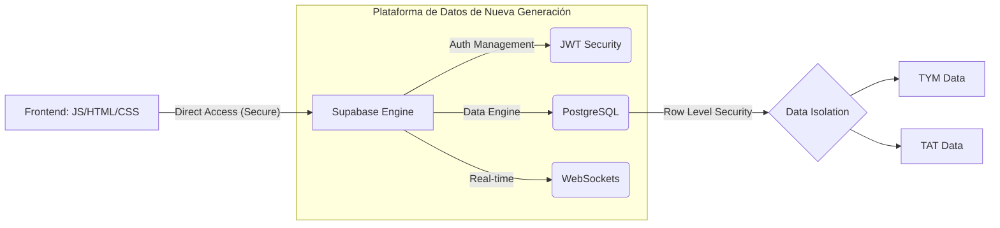

# FletesApp: Ecosistema Digital de Gestión Logística
> **Documento Estratégico y Técnico para Exposición Ejecutiva**

---

## 🎯 1. Propósito del Proyecto
**FletesApp** no es simplemente una base de datos; es una herramienta de **inteligencia operativa** diseñada para transformar la captura de datos caótica en decisiones financieras precisas. El sistema centraliza la operación de fletes de múltiples razones sociales (**TYM** y **TAT**) en una interfaz única, eliminando silos de información y fugas de capital por cálculos manuales erróneos.

---

## 🏗️ 2. Arquitectura de Vanguardia: "The Backend-less Paradigm"

Tradicionalmente, las aplicaciones requieren un servidor intermedio (Backend) complejo de mantener. FletesApp utiliza un enfoque **Modern Serverless**, eliminando intermediarios innecesarios.

### 💎 El Stack Tecnológico
*   **Core**: Vanilla JavaScript (Motor de lógica puro, sin sobrecarga de frameworks).
*   **Estética**: CSS3 Custom Design (Interfaz "Glassmorphism" de alto impacto visual).
*   **Motor de Datos**: Supabase (Infraestructura empresarial escalable).
*   **Analítica**: Chart.js (Visualización interactiva de KPIs).

---

## 💡 3. Argumentación Estratégica: ¿Por qué este enfoque?

### A. Seguridad de Grado Bancario (RLS)
> [!IMPORTANT]
> **Aislamiento Multi-Tenancy**: A diferencia de los sistemas tradicionales donde un error de código puede exponer datos de otra empresa, FletesApp utiliza **RLS (Row Level Security)** directamente en el motor PostgreSQL. La seguridad está "grabada" en los datos, no en el código.

### B. Comparativa: Sistema Tradicional vs. FletesApp

| Característica | Backend Tradicional (Node/PHP) | Arquitectura FletesApp (Supabase) |
| :--- | :--- | :--- |
| **Tiempo de Respuesta** | Sujeto a latencia del servidor API | Latencia ultra-baja (acceso directo) |
| **Tiempo Real** | Requiere configuración compleja | Nativo y automático (WebSockets) |
| **Mantenimiento** | Alto (Actualizaciones de SO, API, Parches) | **Cero** (Infraestructura gestionada) |
| **Seguridad** | Depende del programador | Robusta y nativa por base de datos |

### C. Eficiencia de Costos y Escalabilidad
Al no tener un servidor encendido 24/7 procesando peticiones innecesarias, el costo de infraestructura es prácticamente nulo para operaciones iniciales y escala solo con el uso real del negocio.

---

## � 4. Funcionalidades de Alto Valor (Core Business)

1.  **Motor de Precios Inteligente**: Lógica multi-proveedor autogestionada que aplica tarifas dinámicas según población y proveedor, eliminando la necesidad de que el operario conozca todos los precios.
2.  **Dashboard de Rentabilidad**: Visualización inmediata del gasto mensual y distribución por zona. El sistema alerta visualmente (Rojo) si el flete no es rentable frente al valor de la carga.
3.  **Gestión de Flota Autónoma**: Validaciones en tiempo real para placas y conductores, impidiendo el uso de vehículos inactivos.
4.  **Reporting Profesional**: Generación instantánea de planillas de fletes en PDF con firmas de responsabilidad, listas para la contabilidad oficial.

---

## 🏁 5. Conclusión: El Futuro de la Gestión
FletesApp posiciona a la empresa en la frontera tecnológica. Al adoptar una arquitectura **Serverless**, garantizamos una plataforma que no caducará, que es fácil de mantener y que pone la seguridad del dato por encima de todo. 

> **"Transformamos la logística en datos, y los datos en rentabilidad."**
